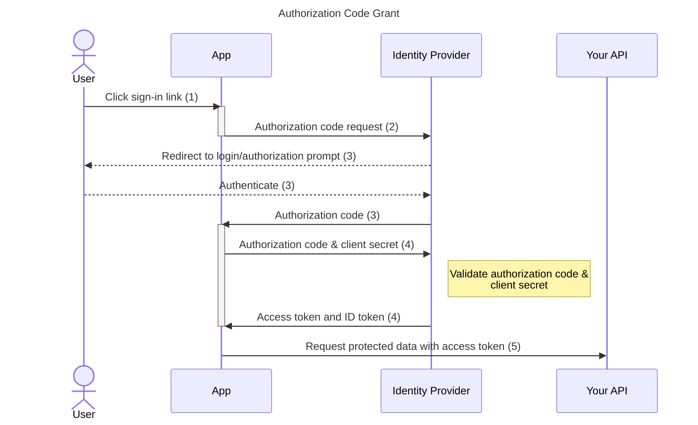

# Backend
To generate web server, we use [openapi-generator](https://github.com/OpenAPITools/openapi-generator). Mustache templates are fetched from [resource directory](https://github.com/OpenAPITools/openapi-generator/tree/master/modules/openapi-generator/src/main/resources) with the following command.

```sh
react-ts-sandbox/schema $ openapi-generator author template -g python-fastapi -o ./backend-template
```

General steps:
  1. Define shema.
    Just edit [openapi.yaml](./openapi.yaml). The only rule is to add description to every api entry point.
    Without it, openapi generator fails to add BaseApi.To check available variables, see [docs](https://github.com/OpenAPITools/openapi-generator/blob/master/docs/generators/python-fastapi.md)
  
  1. Generate server code.
      ```sh
      react-ts-sandbox/schema $ openapi-generator generate -i openapi.yaml -t backend-template -g python-fastapi -o ../backend/api_auto_generated
      ```
    Also, you can generate both server/client code at once by [generate.sh](./generate.sh)
      ```sh
      react-ts-sandbox/schema $ ./generate.sh
      ```
      
  1. Add impl code.
  
     In the latest openapi generator, impl class is introduced so that developer can clearly understand where is auto generated or should be implemented by developer. 
     
     So after previous step, create your favorite filename under [impl directory](../backend/api_auto_generated/src/openapi_server/impl/), inherit BaseXxxApi class and implement it. On runtime, BaseXxxApi automatically find subclass of itself, and call actual implementation, which is realized by builtin [__init__subclass__](https://docs.python.org/ja/3/reference/datamodel.html#object.__init_subclass__) added from python 3.6.
     
  1. Finally run on docker by the following command.
      ```sh
      react-ts-sandbox/backend/api_auto_generated $ docker-compose up
      ```

## TODO
    - Curently docker rebuild package when files under src are edited. This is because, openapi_server is packaged and regarded as part of python module. To improve the performance we should add layer that only install third party library, and then add apis.

# Frontend
  1. Generate client code.
      ```sh
      react-ts-sandbox/frontend $ npm run gen-api
      ```
    Also, you can generate both server/client code at once by [generate.sh](./generate.sh)
      ```sh
      react-ts-sandbox/schema $ ./generate.sh
      ```
  1. To know how to use generated codes, you can visit [here](https://xata.io/blog/openapi-typesafe-react-query-hooks)


# Security Flow
We use [OAut 2.0 implicit grant](https://datatracker.ietf.org/doc/html/rfc6749#section-4.2) for authorization flow.

TODO(shunmaruko): Maybe better to use oidc, but for now it seems a overkill.. [(Reference)](https://qiita.com/kura_lab/items/9159f092a57f26c290cf#%E6%96%B0%E8%A6%8F%E3%81%ABspa%E3%82%92%E6%8F%90%E4%BE%9B%E3%81%99%E3%82%8B%E5%A0%B4%E5%90%88%E3%81%AFoauth-20%E3%82%92%E9%81%B8%E6%8A%9E%E3%81%99%E3%82%8B)
## Memo
Memo of [fastapi-tutorial](https://fastapi.tiangolo.com/tutorial/security/oauth2-jwt/) and [fastapi-scope](https://fastapi.tiangolo.com/advanced/security/oauth2-scopes/).

words
| Word | Meaning |
| ---- | ---- |
| Scope | アクセスができる範囲を表す文字列。通常:で区切られることが多いらしい<br>(例) user:read, admin等 |
## Authorization Flow



1. The user clicks sign-in within the application.
2. `signinRedirect()` or `signinPopup()` must be used to start the flow.
3. The identity provider authenticates the user and stores the code_challenge and redirects the user back to the application with an authorization code.
4. `signinCallback()` handles this callback by sending this authorization code and client secret to the identity provider and receiving in return the access token and ID token.
5. The access token is now accessible via `getUser()?.access_token` and inserted into the requests to your protected API.